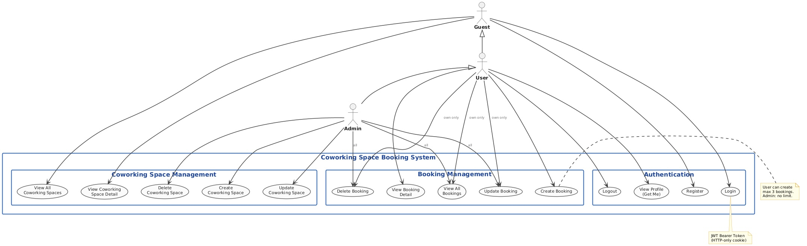
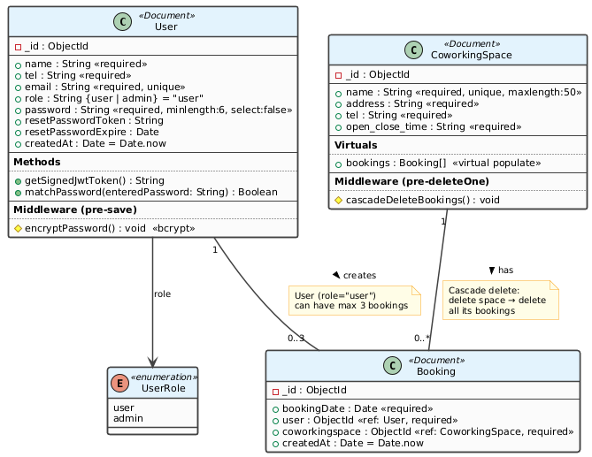
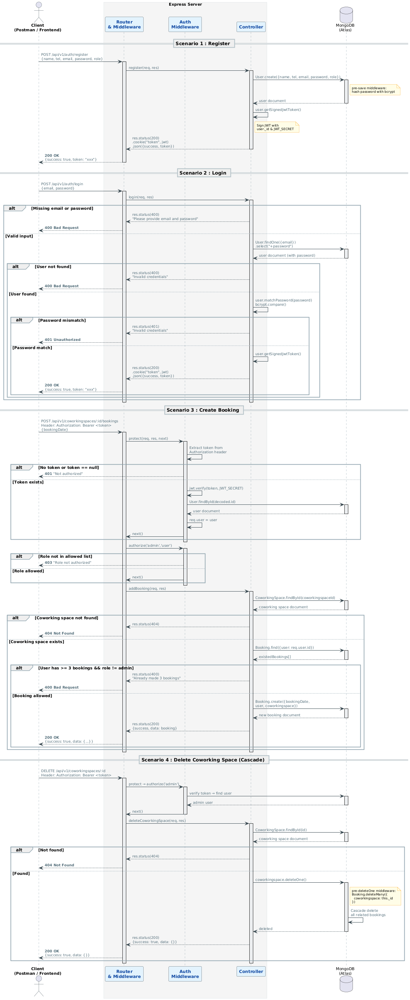

# 🏢 Co-working Space Reservation API


ระบบ Backend API สถาปัตยกรรม RESTful สำหรับบริหารจัดการสถานที่ทำงานร่วม (Co-working Space) และการจองพื้นที่ พัฒนาขึ้นสำหรับ **CEDT68 Project** โดยรองรับระบบสมาชิก การแบ่งสิทธิ์ผู้ใช้งาน (Role-Based Access Control) และมีระบบรักษาความปลอดภัยของ API อย่างครบถ้วน ตามข้อกำหนด Functional และ Non-Functional Requirements

---

## 🌟 Features (คุณสมบัติของระบบ)

* **Authentication & Authorization:** * ระบบ Register และ Login ด้วยอีเมลและรหัสผ่าน (เก็บข้อมูล User: Name, Email, Tel, Password)
  * ใช้ JSON Web Tokens (JWT) และ HTTP-only Cookies ในการยืนยันตัวตน
  * มีระบบ Logout เพื่อล้างข้อมูล Cookie อย่างปลอดภัย
* **Role-Based Access Control (RBAC):**
  * **User:** สามารถดูสถานที่, สร้างการจอง (จำกัดสูงสุด 3 สิทธิ์ต่อคน), แก้ไข และลบการจองของตนเองได้
  * **Admin:** มีสิทธิ์ในการจัดการสถานที่ (CRUD) และสามารถจัดการการจองของผู้ใช้งานทุกคนได้
* **Advanced Database Relations:**
  * ใช้ Mongoose Virtual Populate เพื่อเชื่อมโยงข้อมูลระหว่าง Coworking Space และ Booking
  * มีระบบ Cascade Delete (หากลบสถานที่ทำงาน การจองที่เกี่ยวข้องทั้งหมดจะถูกลบไปด้วย)
* **Security:** ปกป้องระบบด้วย Helmet, XSS Protection, Mongo Sanitize, Rate Limiting, HPP และ CORS
* **API Documentation:** มีหน้า Interactive API Document ขับเคลื่อนโดย Swagger UI

---

## 📊 System Diagrams (เอกสารประกอบการออกแบบระบบ)

### 1. Use Case Diagram
*(แสดงสิทธิ์การใช้งานของระบบระหว่าง User และ Admin)*
 ### 2. Class Diagram (UML Profile)
*(แสดงโครงสร้างของฐานข้อมูลและความสัมพันธ์ระหว่าง User, CoworkingSpace และ Booking)*
 ### 3. Sequence Diagram
*(แสดงลำดับการทำงานและส่งข้อมูลของ API)*
 ---

## 🛠️ Tech Stack (เทคโนโลยีที่ใช้งาน)

* **Runtime Environment:** Node.js
* **Framework:** Express.js
* **Database:** MongoDB Atlas & Mongoose ODM
* **Security & Tools:** Bcryptjs, JsonWebToken, Helmet, Express-Mongo-Sanitize, XSS-clean, Express-Rate-Limit
* **Documentation:** Swagger-JSDoc, Swagger-UI-Express

---

## 🚀 Getting Started (การติดตั้งและรันระบบ)

### 1. โคลนโปรเจกต์และติดตั้ง Dependencies
```bash
git clone https://github.com/2110503-CEDT68/be-project-68-cucode
cd be-project-68-cucode
npm install
```
### 2. ตั้งค่า Environment Variables
* สร้างไฟล์ config.env ไว้ในโฟลเดอร์ config/ และกำหนดค่าดังนี้:
```bash
PORT=5000
NODE_ENV=development
MONGO_URI=<your-mongodb-connection-string>
JWT_SECRET=<your-jwt-secret-key>
JWT_EXPIRE=30d
JWT_COOKIE_EXPIRE=30
```
### 3. รันเซิร์ฟเวอร์
สำหรับโหมดนักพัฒนา (Development) ใช้คำสั่ง:
```bash
npm run dev
```
### 📖 API Documentation
โปรเจกต์นี้มาพร้อมกับ Swagger UI เพื่อให้คุณสามารถดู Endpoint ทั้งหมดและทดสอบยิง API ได้ทันที
หลังจากรันเซิร์ฟเวอร์แล้ว ให้เปิดเบราว์เซอร์และเข้าไปที่: http://localhost:5000/api-docs

### 👥 Contributors (สมาชิกผู้จัดทำ)
* นรินธร ยางงาม - 6833136121
* ปณิชา กีรติบุญญากร - 6833149321
* ปวงศ์ถวัตน์ วิจิตพจน์ - 6833157321

## SW Dev Practice Project Listings